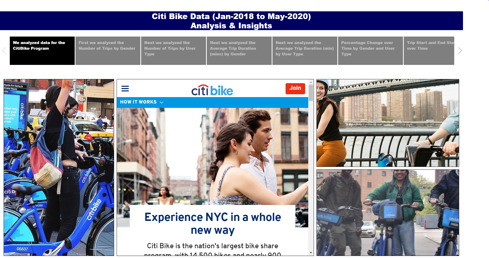
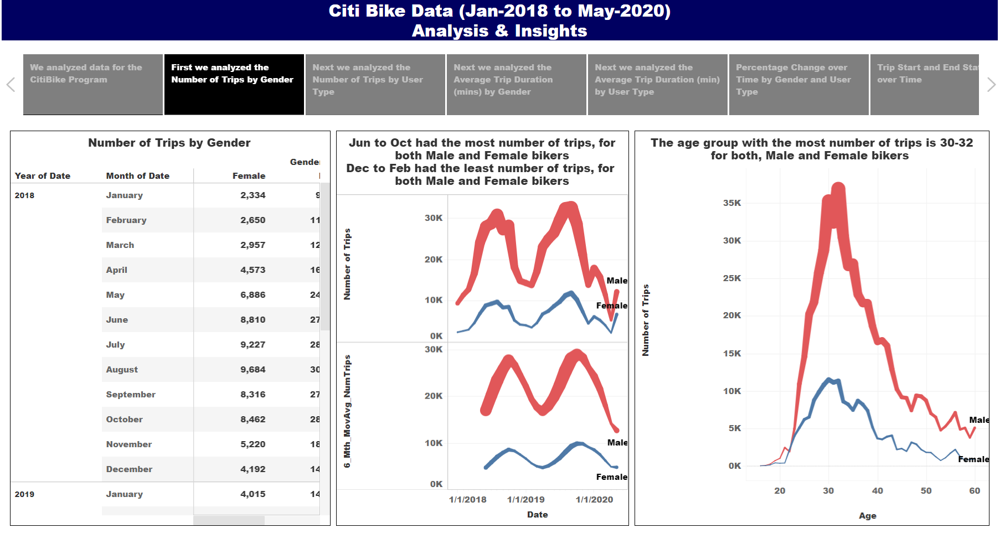
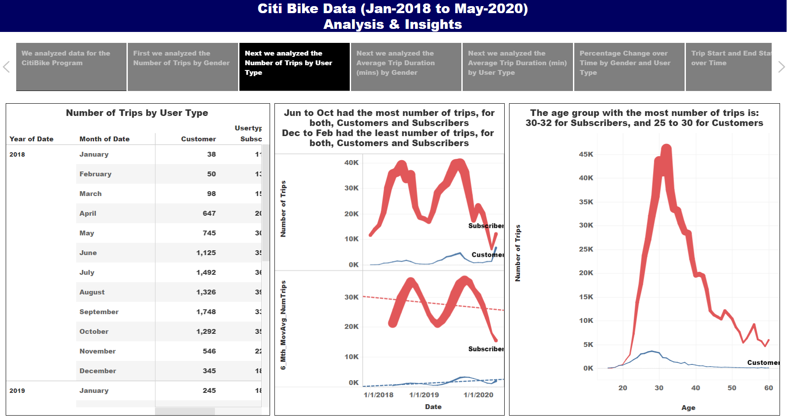
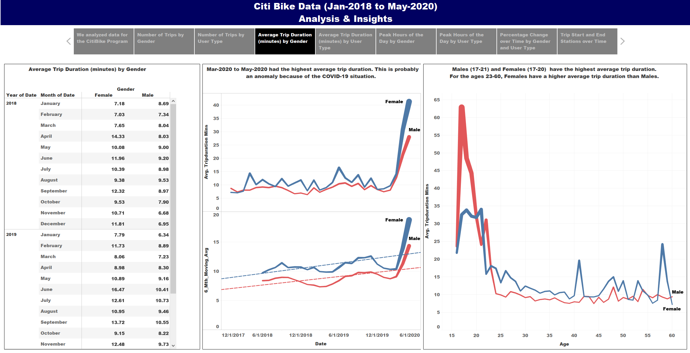
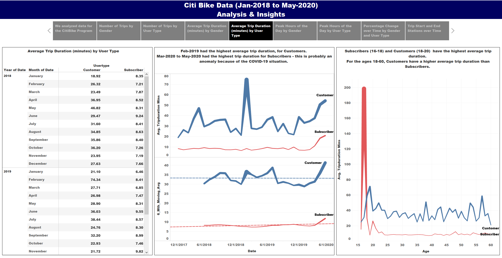
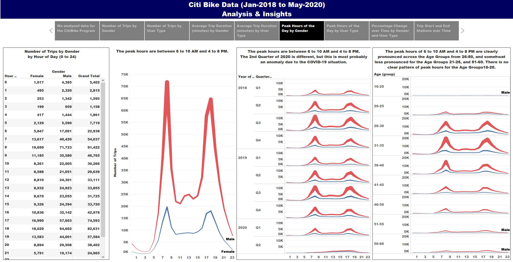
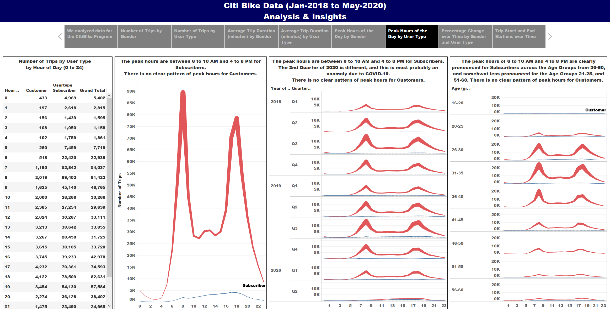
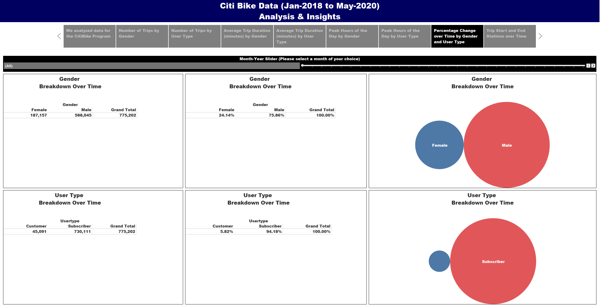
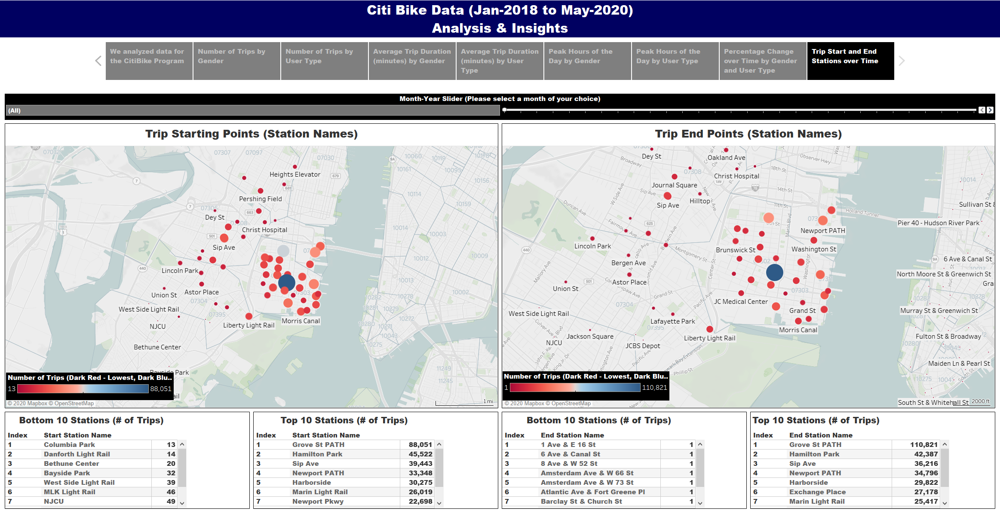

# Tableau - Challenge

## This repository contains the files regarding a Tableau exercise conducted with data for the Citi Bike Program. 
1.	Tableau file that contains 32 visualizations, 9 DashBoards, and 1 Story. 
2.	Images folder that contains Images used for the Story, as well as screenshots of each Caption in the Story. 

## Data Extraction:
Data was extracted for the period Jan-2018 to May-2020 (29 months) from the following website. 
 
 
https://www.citibikenyc.com/system-data
 
 
The data had the following columns:
* Trip Duration (seconds)
* Start Time and Date
* Stop Time and Date
* Start Station Name
* End Station Name
* Station ID
* Station Lat/Long
* Bike ID
* User Type (Customer = 24-hour pass or 3-day pass user; Subscriber = Annual Member)
* Gender (Zero=unknown; 1=male; 2=female)
* Year of Birth. 

## Data Transformation:
Jupyter Notebook was used to clean and combine the data from the 29 individual monthly CSV files, into one single combined Excel file.
 
There were 859,885 records in the raw dataset - - each record represents a trip.
 
We eliminated 84,683 records as part of cleaning up the data (there were records where the Gender was specified as Unknown and the Birth Year was specified as 1969 - - these were records where the users did not provide their Gender, and also seemed to provide a fictitious year (1969) as their Birth Year.
 
Our final dataset had 775,202 records.

## Data Load: 
The combined excel file was then loaded into a Tableau file and analyzed via the creation of 24 Visualizations, 7 DashBoards and 1 Story.
The final Tableau file can be found here:
 
 
https://public.tableau.com/profile/firdosh.patel#!/vizhome/Citi_Bike_Data_Analysis/Story1
 
 

## Attached below is a screenshot of the 1st Caption of the Tableau Story: 

 
This caption contains a link to the official webpage of the Citi Bike Program. 
 

## Attached below is a screenshot of the 2nd Caption of the Tableau Story: 

 
This caption contains 3 visualizations:
1. A Table showing the number of trips by Gender by Month. Of the 775,202 trips, 187,157 trips were by Female Bikers, and 588,045 trips were by Male Bikers.
2. A two-part Visualization showing the raw number of trips by Gender by Month, and also a 6 month moving average of the number of trips by Gender by Month. As can be seen, June to October had the most number of trips, and December to February had the least number of trips.
3. A visualization showing the number of trips by Gender by Age. As can be seen, the age group 30-32 had the most number of trips. This was rather surprising, since we were expecting the Age Group with the most number of trips to be a bit younger -- in the age group of 20-25. 

## Attached below is a screenshot of the 3rd Caption of the Tableau Story: 

 
This caption contains 3 visualizations:
1. A Table showing the number of trips by User Type by Month. Of the 775,202 trips, 45,091 trips were by Customers, and 730,111 trips were by Subscribers.
2. A two-part Visualization showing the raw number of trips by User Type by Month, and also a 6 month moving average of the number of trips by User Type by Month. As can be seen, June to October had the most number of trips, and December to February had the least number of trips.
3. A visualization showing the number of trips by Gender by Age. As can be seen, the age group 30-32 had the most number of trips for Subscribers, and the age group 25-30 had the most number of trips for Customers. This was rather surprising, since we were expecting the Age Group with the most number of trips to be a bit younger -- in the age group of 20-25. 

## Attached below is a screenshot of the 4th Caption of the Tableau Story: 

 
This caption contains 3 visualizations:
1. A Table showing the average trip duration in minutes by Gender by Month. 
2. A two-part Visualization showing the average trip durations by Gender by Month, and also a 6 month moving average of the average trip duration by Gender by Month. As can be seen, March 2020 to May 2020 had the highest average trip duration. This seems to be an anomaly caused by the COVID-19 situation. This was very surprising since we did not expect much activity in the period March 2020 to May 2020 given the stay-at-home orders and social distancing measures implemented in New York.
3. A visualization showing the average trip duration by Gender by Age. As can be seen, Males aged 17-21 and Females aged 17-20 had the highest average trip duration. Also for the age group 23-60, the average trip duration was higher for Female Bikers than Male Bikers. This was also an unexpected finding.   

## Attached below is a screenshot of the 5th Caption of the Tableau Story: 

 
This caption contains 3 visualizations:
1. A Table showing the average trip duration in minutes by User Type by Month. 
2. A two-part Visualization showing the average trip durations by User Type by Month, and also a 6 month moving average of the average trip duration by User Type by Month. As can be seen, February 2019 had the highest average trip duration for Customers. March 2020 to May 2020 had the highest average trip duration for subscribers -- this seems to be an anomaly caused by the COVID-19 situation. This was very surprising since we did not expect much activity in the period March 2020 to May 2020 given the stay-at-home orders and social distancing measures implemented in New York.
3. A visualization showing the average trip duration by User Type by Age. As can be seen, Subscribers aged 16-18 and Customers aged 18-20 had the highest average trip duration. Also for the age group 18-60, the average trip duration was higher for Customers than Subscribers.   

## Attached below is a screenshot of the 6th Caption of the Tableau Story: 

 
This caption contains 4 visualizations:
1. A Table showing the number of trips by Gender by Hour of the Day. 
2. A Visualization showing the number of trips by Gender by Hour of the Day. As can be seen, the peak biking hours during the day (the hours with the most number of trips) are 6 to 10 AM and 4 to 8 PM. 
3. A Visualization showing the number of trips by Gender by Hour of the Day, further broken down by Year and Quarter. As can be seen, the peak biking hours during the day are 6 to 10 AM and 4 to 8 PM, except for the 2nd Quarter of 2020, which could be an anomaly caused by the COVID-19 situation.  
4. A Visualization showing the number of trips by Gender by Hour of the Day, further broken down by Age. As can be seen, the peak biking hours during the day are 6 to 10 AM and 4 to 8 PM. This is quite pronounced for the age groups 26-50 and less pronounced for the age groups 21-25 and 51-60. There is no clear pattern regarding peak biking hours for the age group 16-20. 

## Attached below is a screenshot of the 7th Caption of the Tableau Story: 

 
This caption contains 4 visualizations:
1. A Table showing the number of trips by User Type by Hour of the Day. 
2. A Visualization showing the number of trips by User Type by Hour of the Day. As can be seen, the peak hours during the day (the hours with the most number of trips) are 6 to 10 AM and 4 to 8 PM for Subscribers. There is no clear pattern regarding peak biking hours for Customers.  
3. A Visualization showing the number of trips by Gender by Hour of the Day, further broken down by Year and Quarter. As can be seen, the peak hours during the day are 6 to 10 AM and 4 to 8 PM for Subscribers, except for the 2nd Quarter of 2020, which could be an anomaly caused by the COVID-19 situation. There is no clear pattern regarding peak biking hours for Customers. 
4. A Visualization showing the number of trips by Gender by Hour of the Day, further broken down by Age. As can be seen, the peak hours during the day are 6 to 10 AM and 4 to 8 PM for Subscribers -- this is quite pronounced for the age groups 26-50 and less pronounced for the age groups 21-25 and 51-60. There is no clear pattern regarding peak biking hours for Customers. 

## Attached below is a screenshot of the 8th Caption of the Tableau Story: 

 
This caption contains 6 summary visualizations:
1. A Table showing the number of trips by Gender. Of the 775,202 trips, 187,157 trips were by Female Bikers, and 588,045 trips were by Male Bikers.
2. A Table showing the percentage of the number of trips by Gender. Of the total trips, 24.14% were by Female Bikers, and 75.86% were by Male Bikers. 
3. A Visualization showing the proportion of the trips by Female Bikers compared to the trips by Male Bikers. 
4. A Table showing the number of trips by User Type. Of the 775,202 trips, 45,091 trips were by Customers, and 730,111 trips were by Subscribers.
5. A Table showing the percentage of the number of trips by User Type. Of the total trips, 5.82% were by Customers, and 94.18% were by Subscribers.  
6. A Visualization showing the proportion of the trips by Customers compared to the trips by Subscribers.
 
There is a date slider at the top of the page. You can use this slider to select a month of your choice. This allows you to see how these 6 visualizations change over time.

## Attached below is a screenshot of the 9th Caption of the Tableau Story: 

 
This caption contains 6 visualizations:
1. A Map showing the starting points (stations) for the trips. 
2. A Table showing the names of the bottom 10 starting points (stations) - - starting points with the least number of trips.
3. A Table showing the names of the top 10 starting points (stations) - - starting points with the most number of trips.
4. A Map showing the ending point for the trips. 
5. A Table showing the names of the bottom 10 ending points (stations) - - ending points with the least number of trips. 
6. A Table showing the names of the top 10 ending points (stations) - - ending points with the most number of trips. 
 
There is a date slider at the top of the page. You can use this slider to select a month of your choice. This allows you to see how these 6 visualizations change over time.

## Conclusions: 
We analyzed data for the Citi Bike Program from January 2018 to May-2020. 
 
Our final dataset had 775,202 records.
 
Our findings were as follows:

#### Gender Based Analysis:
1. Of the 775,202 trips, 187,157 trips (24.14%) were by Female Bikers, and 588,045 trips (75.86%) were by Male Bikers. 
2. For both,  Male and Female Bikers, the most number of trips were in June to October, and the least number of trips were in December to February. 
3. For both, Male and Female Bikers, the age group 30-32 had the most number of trips. This was rather surprising, since we were expecting the Age Group with the most number of trips to be a bit younger -- in the age group of 20-25.
4. For both, Male and Female Bikers, March 2020 to May 2020 had the highest average trip duration. This seems to be an anomaly caused by the COVID-19 situation. This was very surprising since we did not expect much activity in the period March 2020 to May 2020 given the stay-at-home orders and social distancing measures implemented in New York.
5. Male Bikers aged 17-21 and Female Bikers aged 17-20 had the highest average trip duration. For the age group 23-60, the average trip duration was higher for Female Bikers than Male Bikers. This was an unexpected finding. 
6. For both, Male and Female Bikers, the peak biking hours during the day are 6 to 10 AM and 4 to 8 PM, for the entire time period analyzed, except for the 2nd Quarter of 2020, which could be an anomaly caused by the COVID-19 situation. 
7. For both, Male and Female Bikers, the peak biking hours during the day are 6 to 10 AM and 4 to 8 PM for the age groups 26-50, and also for the age groups 21-25 and 51-60 (although slightly less pronounced). There is no clear pattern regarding peak biking hours for the age group 16-20. 

#### User Type Based Analysis:
1. Of the 775,202 trips, 45,091 trips (5.82%) were by Customers, and 730,111 trips (95.18%) were by Subscribers.
2. For both,  Customers and Subscribers, the most number of trips were in June to October, and the least number of trips were in December to February. 
3. For Subscribers, the age group 30-32 had the most number of trips. For Customers, the age group 25-30 had the most number of trips. This was rather surprising, since we were expecting the Age Group with the most number of trips to be a bit younger -- in the age group of 20-25.
4. For Customers, February 2019 had the highest average trip duration. For Subscribers, March 2020 to May 2020 had the highest average trip duration -- this seems to be an anomaly caused by the COVID-19 situation. This was very surprising since we did not expect much activity in the period March 2020 to May 2020 given the stay-at-home orders and social distancing measures implemented in New York.
5. Subscribers aged 16-18 and Customers aged 18-20 had the highest average trip duration. For the age group 18-60, the average trip duration was higher for Customers than Subscribers.   
6. For Subscribers, the peak biking hours during the day are 6 to 10 AM and 4 to 8 PM for the entire time period analyzed, except for the 2nd Quarter of 2020, which could be an anomaly caused by the COVID-19 situation. There is no clear pattern regarding peak biking hours for Customers. 
7. For Subscribers, the peak hours during the day are 6 to 10 AM and 4 to 8 PM for the age groups 26-50, and also for the age groups 21-25 and 51-60 (although slightly less pronounced). There is no clear pattern regarding peak biking hours for Customers. 

