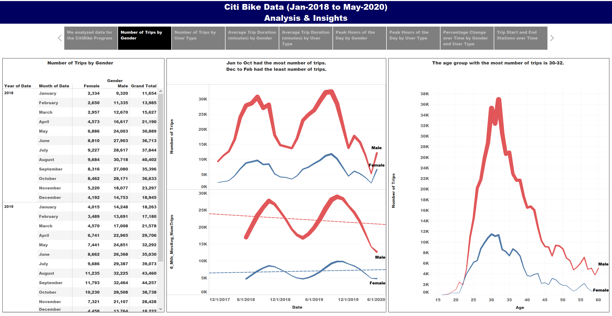
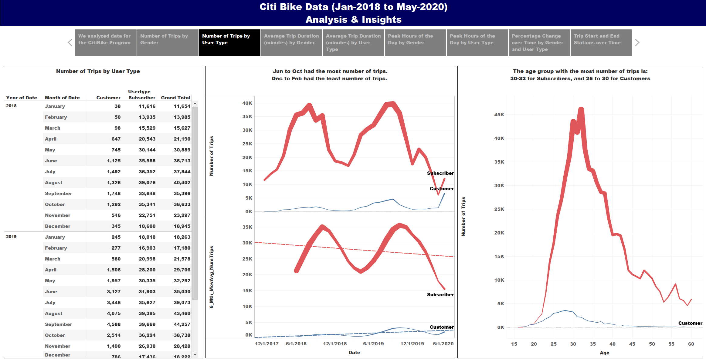

# Tableau - Challenge

## This repository contains the files regarding a Tableau exercise conducted with data for the Citi Bike Program. 
1.	Tableau file that contains 32 visualizations, 9 DashBoards, and 1 Story. 
2.	Images folder that contains Images used for the Story, as well as screenshots of each Caption in the Story. 

## Data Extraction:
Data was extracted for the period Jan-2018 to May-2020 (29 months) from the following website. 
 
 
https://www.citibikenyc.com/system-data
 
 
The data had the following columns:
* Trip Duration (seconds)
* Start Time and Date
* Stop Time and Date
* Start Station Name
* End Station Name
* Station ID
* Station Lat/Long
* Bike ID
* User Type (Customer = 24-hour pass or 3-day pass user; Subscriber = Annual Member)
* Gender (Zero=unknown; 1=male; 2=female)
* Year of Birth. 

## Data Transformation:
Jupyter Notebook was used to clean and combine the data from the 29 individual monthly CSV files, into one single combined Excel file.

## Data Load: 
The combined excel file was then loaded into a Tableau file and analyzed via the creation of 24 Visualizations, 7 DashBoards and 1 Story.
The final Tableau file can be found here:
 
 
https://public.tableau.com/profile/firdosh.patel#!/vizhome/Citi_Bike_Data_Analysis/Story1
 
 

## Attached below is a screenshot of the 1st Caption of the Tableau Story . 

 
This caption contains a link to the official webpage of the Citi Bike Program. 

## Attached below is a screenshot of the 2nd Caption of the Tableau Story . 

 
This caption contains 3 visualizations:
1. A Table showing the number of trips by Gender by Month. Of the 775,202 trips, 187,157 trips were by Female Bikers, and 588,045 trips were by Male Bikers.
2. A two-part Visualization showing the raw number of trips by Gender by Month, and also a 6 month moving average of the number of trips by Gender by Month.
3. A visualization showing the number of trips by Gender by Age.

## Attached below is a screenshot of the 3rd Caption of the Tableau Story . 

## Attached below is a screenshot of the 4th Caption of the Tableau Story . 

## Attached below is a screenshot of the 5th Caption of the Tableau Story . 

## Attached below is a screenshot of the 6th Caption of the Tableau Story . 

## Attached below is a screenshot of the 7th Caption of the Tableau Story . 

## Attached below is a screenshot of the 8th Caption of the Tableau Story . 

## Attached below is a screenshot of the 9th Caption of the Tableau Story . 

## Conclusions:
1.	The 5 states with the highest total number of deaths are as follows:
* *New York: 30,374 (0.16% of the total population)*
* *New Jersey: 12,176 (0.14% of the total population)*
* *Massachusetts: 7,323 (0.10% of the total population)*
* *Pennsylvania: 5,943 (0.05% of the total population)*
* *Illinois: 5,903 (0.05% of the total population)*
2.	The 5 states with the highest total number of deaths per million of population are as follows:
* *New York: 1,562 (0.16% of the total population)*
* *New Jersey: 1,362 (0.14% of the total population)*
* *Connecticut: 1,143 (0.11% of the total population)*
* *Massachusetts: 1,050 (0.10% of the total population)*
* *South Dakota: 927 (0.10% of the total population)*

